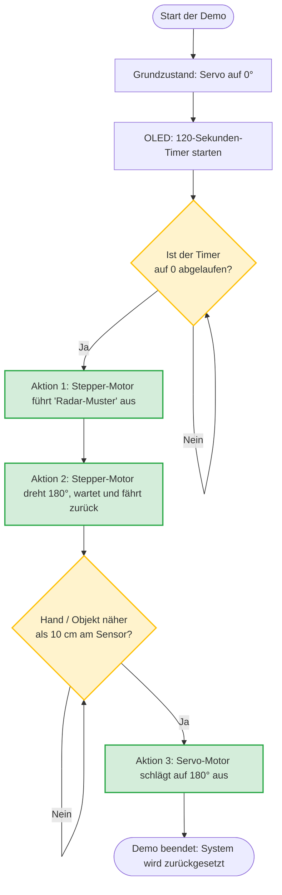

# Demo: MHTF - Cyber-Physical System (CPS) Prototyp

## 1. Projektübersicht & Architektur
Dieses Projekt implementiert einen Cyber-Physical System (CPS) Prototypen mit einer strikten Trennung von Logik und Hardware-Ausführung. 

*   **Logik-Ebene (Raspberry Pi):** Ein modulares Python-Backend übernimmt die komplette Entscheidungsfindung, Zeitsteuerung (Multithreading) und Ablauflogik. Das System nutzt das **"Single Point of Entry"-Muster**, bei dem die `main.py` als alleinige Steuerungszentrale und Command Line Interface (CLI) dient.
*   **Hardware-Ebene (Arduino):** Agiert als "Dumb Bridge". Er empfängt strukturierte String-Befehle über die serielle USB-Schnittstelle, steuert die Aktoren an, liest Sensordaten aus und sendet die Ergebnisse zurück.

Diese Architektur ermöglicht es, komplexe Berechnungen und Multithreading (z. B. asynchrone Displays und Sensor-Loops) auf dem leistungsstärkeren Raspberry Pi auszuführen, während der Arduino die harten Echtzeitanforderungen der Hardware-Pins übernimmt.


---

## 2. Systemanforderungen (Requirements)

### 2.1 Hardware-Anforderungen
*   **Controller:** 
    *   Raspberry Pi (mit USB-Port für serielle Kommunikation)
    *   Arduino (Uno, Nano oder Mega)
*   **Aktoren:**
    *   Schrittmotor: 28BYJ-48 inkl. ULN2003 Treiberboard
    *   Servomotor: SG90
*   **Sensoren & Ausgabe:**
    *   Ultraschallsensor: HC-SR04
    *   OLED Display: 1.3" I2C SH1106 (128x64 Pixel)
*   **Sonstiges:** USB-Kabel (Pi zu Arduino), Jumper-Kabel (Breadboard). *Hinweis: Für einen stabilen Betrieb sollten Stepper und Servo idealerweise über eine separate 5V-Stromquelle (mit gemeinsamem Ground zum Arduino) versorgt werden.*

### 2.2 Software-Anforderungen
*   **Raspberry Pi:** Python 3.x, Bibliothek `pyserial`
*   **Arduino IDE:** Für den Upload des Bridge-Skripts
*   **Arduino Bibliotheken:** `Servo` (Standard), `Stepper` (Standard), `U8g2` (von *oliver*, für das SH1106 Display)

---

## 3. Pin-Layout & Verkabelung (Arduino)

Die Hardware wird wie folgt an den Arduino angeschlossen. Die I2C-Pins variieren je nach Arduino-Modell (beim Uno/Nano sind es A4 und A5).

| Komponente | Pin am Arduino | Bemerkung |
| :--- | :--- | :--- |
| **Servo (SG90)** | `D3` (PWM) | Steuerleitung (meist orange/gelb) |
| **HC-SR04 (Ultraschall)** | `D4` | TRIG (Trigger) |
| | `D5` | ECHO |
| **28BYJ-48 (Stepper via ULN2003)** | `D8` | IN1 |
| | `D10` | IN2 *(Gekreuzt für flüssigen Lauf)* |
| | `D9` | IN3 *(Gekreuzt für flüssigen Lauf)* |
| | `D11` | IN4 |
| **SH1106 OLED Display (I2C)** | `A4` | SDA (Data) |
| | `A5` | SCL (Clock) |

---

## 4. Software-Struktur (Raspberry Pi)

Das Python-Projekt ist modular in einer eigenen Bibliothek (`cps_lib`) aufgebaut. Alle Aufrufe laufen exklusiv über die `main.py`, um Kollisionen auf dem seriellen USB-Port (UART) zu vermeiden.

```text
cps_projekt/
├── cps_bridge.ino           # Arduino C++ "Dumb Bridge" Code
├── main.py                  # Zentraler Einstiegspunkt (CLI & Multithreading)
└── cps_lib/
    ├── __init__.py          
    ├── serial_link.py       # Thread-sicheres Kommunikationsmodul mit Mutex-Lock
    ├── steppermotor.py      # Abstrakte Bewegungsmuster (Radar, 180°-Drehung)
    ├── servomotor.py        # Winkeleinstellung (0-180°)
    ├── ultraschall.py       # Distanzmessung und Parsing
    ├── oled.py              # Hintergrund-Thread für Timer & Systemuhrzeit
    └── demo.py              # Präsentations-Ablauf (wird von main.py aufgerufen)
```

---

## 5. Inbetriebnahme (How to Use)

### Schritt 1: Arduino vorbereiten
1. Öffne die Arduino IDE.
2. Navigiere zu *Sketch -> Bibliothek einbinden -> Bibliotheken verwalten*. Suche nach **U8g2** und installiere die Bibliothek von *oliver*.
3. Verbinde den Arduino per USB mit deinem Rechner.
4. Lade den Code aus der Datei `cps_bridge.ino` auf den Arduino hoch.
5. Verbinde den Arduino nun per USB mit dem Raspberry Pi.

### Schritt 2: Raspberry Pi vorbereiten
1. Klone oder kopiere die gesamte Ordnerstruktur (`cps_projekt/`) auf den Raspberry Pi.
2. Öffne ein Terminal und installiere die benötigte serielle Bibliothek:
   ```bash
   pip install pyserial
   ```
3. Prüfe in der Datei `cps_lib/serial_link.py`, ob der `PORT` korrekt ist (Standardmäßig `/dev/ttyACM0` oder `/dev/ttyUSB0`).

### Schritt 3: Ausführung & Steuerung
Da das System dem "Single Point of Entry"-Prinzip folgt, musst du nur ein einziges Skript starten:

Navigiere im Terminal in den Projektordner und führe aus:
```bash
python main.py
```

Es öffnet sich die CPS Steuerungs-Konsole. Dir stehen folgende Befehle zur Verfügung:

**Automatik-Modus (Hintergrund-Thread):**
*   `auto on` -> Startet die kontinuierliche Ultraschall-Überwachung und die entsprechenden Ausweich-If-Cases.
*   `auto off` -> Stoppt die Sensorauswertung sofort.

**Präsentations-Modus:**
*   `demo` -> Startet den fest programmierten Vorführ-Ablauf (OLED-Timer -> Stepper-Muster -> Warten auf Sensor -> Servo-Aktion). 
    * *Wichtig:* Stelle sicher, dass die Automatik vorher mit `auto off` beendet wurde, damit sich die Funktionen nicht überschneiden.

**Manueller Test-Modus:**
*   `srv <0-180>` -> Steuert den Servomotor auf den genauen Winkel (z.B. `srv 90`).
*   `stp 1` -> Startet manuell das 120° Radar-Sweep-Muster des Steppers (Dauer: 2 Min).
*   `stp 2` -> Startet manuell die 180°-Drehung des Steppers (mit 5s Pause).

**Beenden:**
*   `exit` (oder STRG+C) -> Fährt alle Hintergrund-Threads sauber herunter und schließt die serielle Verbindung.
